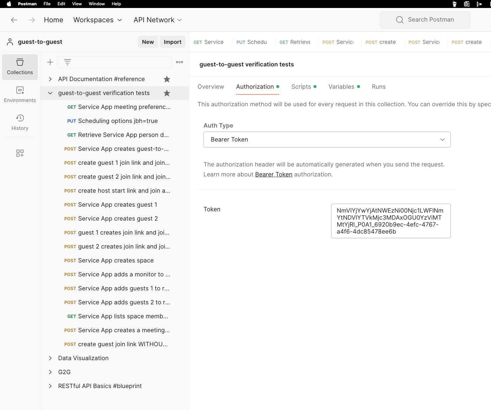
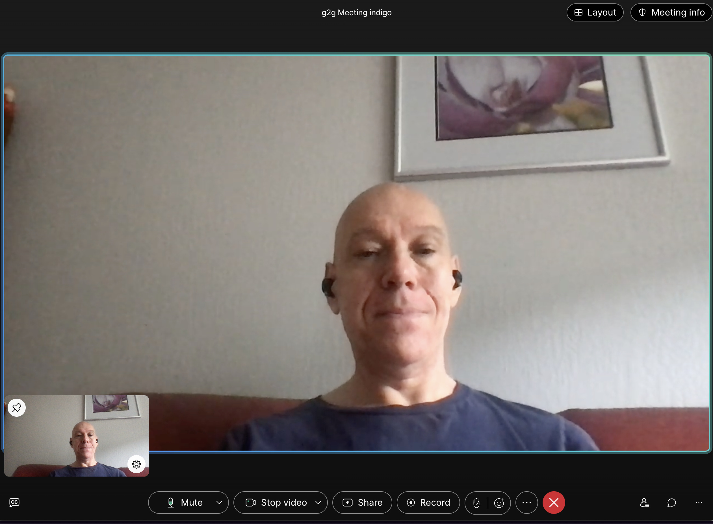

# g2g-meeting-sample

Webex API invocations to test the guest-to-guest meeting functionality

Short and sweet postman collection to test the g2g meeting functionality

First you need to get a sandbox and read through the [guide](https://developer-portal.int-first-general1.ciscospark.com/docs/api/guides/service-apps-as-guest-to-guest-meeting-facilitator-guide#service-apps-as-guesttoguest-meeting-facilitators), so you know what is going on.

If you don't like reading at least read through the bulleted paragraph _Developing a Guest-to-Guest App_

If you followed the _Developing a Guest-to-Guest App_ you have now an access token in hand.

Use that to configure your postman collection.

If you don't want to copy and paste the join and start links run the tiny JavaScript application from the command line.
When the browser tab opens stay in the browser. Each tab can have it's own meeting attendee. In the app you can have only user open.

You can now try to test the g2g functions. Just click through the collection one by one.
When you reached "create host start link and join as host", you have your first g2g meeting. Congratulations!

If will open up Chrome tabs and join you to the meeting.

If both guests are in the lobby you didn't follow the CH config from the guide. Either reread the guide notes or join another person as host.

That's it! Easy!
