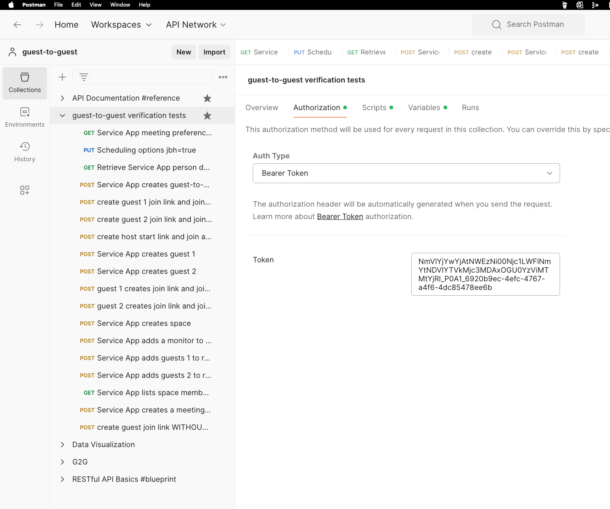
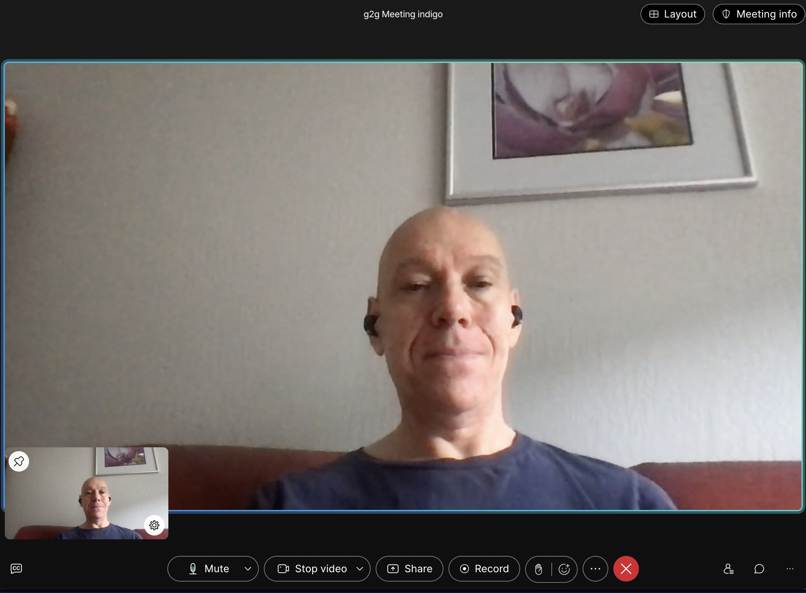

# Guest-to-Guest Meeting Sample

Webex API invocations to test the guest-to-guest meeting functionality with a comprehensive Postman collection and automated browser testing tools.

## 🎯 Overview

This sample provides a short and sweet Postman collection to test the guest-to-guest (G2G) meeting functionality, allowing you to validate that service apps can act as facilitators for meetings between guests who don't have Webex accounts.

## 📋 Prerequisites

**Important**: First you need to get a sandbox and read through the [service apps guide](https://developer-portal.int-first-general1.ciscospark.com/docs/api/guides/service-apps-as-guest-to-guest-meeting-facilitator-guide#service-apps-as-guesttoguest-meeting-facilitators), so you know what is going on.

If you don't like reading, at least read through the bulleted paragraph **"Developing a Guest-to-Guest App"**.

### Requirements

- **Webex Sandbox Account**: Required for testing G2G functionality
- **Service App Access Token**: If you followed the "Developing a Guest-to-Guest App" guide, you have now an access token in hand
- **Postman**: For running the API collection
- **Node.js**: For running the automated browser testing tool
- **Google Chrome**: For automated meeting joins

## 🚀 Quick Start

### 1. Configure Postman Collection

Use your service app access token to configure the Postman collection:



### 2. Import the Collection

Import the `guest-to-guest_verification_test.postman_collection.json` file into Postman.

### 3. Set Up Environment Variables

Configure the following variables in your Postman environment:
- **Access Token**: Your service app access token
- **Meeting ID**: Will be populated automatically during testing
- **Meeting Password**: Will be populated automatically during testing

### 4. Run the Test Sequence

You can now try to test the G2G functions. Just click through the collection one by one:

1. **Service App meeting preferences**
2. **Scheduling options jbh=true**
3. **Service App creates guest-to-guest meeting**
4. **Create guest 1 join link and join as attendee**
5. **Create guest 2 join link and join as attendee**
6. **Service App creates guest 1**
7. **Service App creates guest 2**
8. **Create host start link and join as host** - 🎉 Your first G2G meeting!
9. **Guest 1 creates join link and join as attendee**

When you reach "create host start link and join as host", you have your first G2G meeting. Congratulations!

## 🔧 Automated Browser Testing

### Setup

If you don't want to copy and paste the join and start links, run the tiny JavaScript application from the command line:

```bash
node runChromeTab.js
```

### Usage

When the browser tab opens, stay in the browser. Each tab can have its own meeting attendee. In the app you can have only one user open.

The application will:
- Start a local server on port 3000
- Automatically open Chrome tabs for meeting participants
- Join you to the meeting when triggered by the Postman collection

## 📁 Project Structure

```
g2g-meeting-sample/
├── guest-to-guest_verification_test.postman_collection.json  # Main API test collection
├── runChromeTab.js                                          # Automated browser launcher
├── postman.png                                             # Postman configuration screenshot
├── screenshot.png                                          # Meeting interface screenshot
├── package.json                                            # Node.js dependencies
├── .github/workflows/                                      # GitHub Actions
│   ├── prettier.yml                                       # Code formatting checks
│   └── ruff.yml                                           # Python linting
└── README.md                                               # This file
```

## 📊 Postman Collection Details

The collection includes comprehensive tests for the complete G2G meeting workflow:

### API Endpoints Tested

| Request | Description | Purpose |
|---------|-------------|---------|
| **Service App meeting preferences** | GET `/v1/meetingPreferences` | Verify service app can access meeting preferences |
| **Scheduling options jbh=true** | GET `/v1/meetings/schedulingOptions` | Confirm Join Before Host (JBH) is enabled |
| **Service App creates guest-to-guest meeting** | POST `/v1/meetings` | Create the G2G meeting |
| **Create guest join links** | POST `/v1/meetings/{meetingId}/joinLinks` | Generate join links for guests |
| **Service App creates guests** | POST `/v1/meetings/{meetingId}/guests` | Create guest participants |
| **Create host start link** | POST `/v1/meetings/{meetingId}/joinLinks` | Generate host join link |

### Test Assertions

Each request includes automated tests that verify:
- **Status codes**: Ensures API calls succeed (200 OK)
- **Response structure**: Validates required fields are present
- **Meeting configuration**: Confirms G2G settings are correct
- **Guest creation**: Verifies guest participants are created properly

### Environment Variables

The collection automatically populates these variables:
- `meetingId`: Generated when creating the meeting
- `meetingPassword`: Meeting password for guests
- `hostStartLink`: Direct link for host to start meeting
- `guest1JoinLink`: Join link for first guest
- `guest2JoinLink`: Join link for second guest

## 🛠️ Chrome Tab Automation

The `runChromeTab.js` utility provides automated browser launching:

### Features

- **HTTP Server**: Runs on localhost:3000
- **URL Parsing**: Extracts meeting URLs from requests
- **Chrome Integration**: Automatically opens meeting links in Chrome
- **Multiple Tabs**: Supports multiple meeting participants
- **Error Handling**: Graceful handling of browser launch failures

### Usage Flow

1. Start the automation server: `node runChromeTab.js`
2. Run Postman collection requests
3. Meeting links are automatically opened in Chrome
4. Each participant gets their own browser tab

## 🧪 Testing Scenarios

### Successful G2G Meeting

When everything is configured correctly:
1. Host joins and starts the meeting
2. Guests can join directly (no lobby)
3. All participants can see and hear each other
4. Meeting functions normally

### Common Issues

**Both guests in lobby**: If both guests are in the lobby, you didn't follow the CH (Call Home) config from the guide. Either:
- Reread the guide notes, or
- Join another person as host



### Troubleshooting

- **401 Unauthorized**: Check your service app access token
- **404 Not Found**: Verify the meeting ID is correct
- **Chrome not opening**: Ensure Google Chrome is installed and accessible
- **JBH not working**: Verify Join Before Host is enabled in meeting preferences

## 🔍 Meeting Configuration

### Guest-to-Guest Requirements

For G2G meetings to work properly:
- **Service App**: Must have appropriate permissions
- **Join Before Host**: Must be enabled (`jbh=true`)
- **Guest Access**: Must be configured in Webex Control Hub
- **Meeting Type**: Must be created by service app

### Control Hub Configuration

Ensure your Webex organization has:
- Guest access enabled
- Appropriate meeting policies
- Service app permissions configured

## 📈 Development Workflow

### Code Quality

The project uses automated code quality checks:
- **Prettier**: Code formatting (`.prettierrc`)
- **ESLint**: JavaScript linting (`eslint.config.js`)
- **Husky**: Git hooks for pre-commit checks
- **Lint-staged**: Automatic formatting on commit

### Scripts

```bash
npm run format    # Format code with Prettier
npm run prepare   # Set up Husky git hooks
```

### GitHub Actions

Automated workflows run on pull requests:
- **Prettier**: Ensures code formatting consistency
- **Ruff**: Python code linting (if applicable)

## 🎭 Demo Personas

The collection uses realistic personas for testing:

### Generated Participants

- **Host**: `Dr. {{$randomFullName}}` (Healthcare provider)
- **Guest 1**: `Patient {{$randomFullName}}` (Hospital A Patient 1)
- **Guest 2**: `Patient {{$randomFullName}}` (Hospital A Patient 2)

### Use Cases

Perfect for testing scenarios like:
- **Telehealth**: Doctor meeting with patients
- **Customer Support**: Agent helping multiple customers
- **Education**: Instructor with guest students
- **Legal**: Attorney with clients

## 📚 API Reference

### Key Endpoints

#### Meeting Preferences
```
GET /v1/meetingPreferences
```
Retrieves service app meeting preferences and capabilities.

#### Create Meeting
```
POST /v1/meetings
```
Creates a new G2G meeting with guest access enabled.

#### Join Links
```
POST /v1/meetings/{meetingId}/joinLinks
```
Generates join links for hosts and guests.

#### Guest Management
```
POST /v1/meetings/{meetingId}/guests
```
Creates guest participants for the meeting.

### Request Examples

#### Create G2G Meeting
```json
{
  "title": "Guest-to-Guest Meeting",
  "start": "2024-01-01T10:00:00Z",
  "end": "2024-01-01T11:00:00Z",
  "enabledJoinBeforeHost": true,
  "allowFirstUserToBeCoHost": false
}
```

#### Create Guest Join Link
```json
{
  "meetingId": "{{meetingId}}",
  "password": "{{meetingPassword}}",
  "joinDirectly": false,
  "email": "{{$randomEmail}}",
  "displayName": "Patient {{$randomFullName}}"
}
```

## 🔐 Security Considerations

- **Access Tokens**: Never commit tokens to version control
- **Meeting Passwords**: Use strong, generated passwords
- **Guest Access**: Limit guest permissions appropriately
- **Audit Logging**: Monitor G2G meeting usage

## 📖 Documentation References

- [Service Apps as Guest-to-Guest Meeting Facilitators Guide](https://developer-portal.int-first-general1.ciscospark.com/docs/api/guides/service-apps-as-guest-to-guest-meeting-facilitator-guide)
- [Webex Meetings API Documentation](https://developer.webex.com/docs/api/v1/meetings)
- [Join Links API Reference](https://developer.webex.com/docs/api/v1/meetings/join-links)

## 🤝 Contributing

1. Fork the repository
2. Create a feature branch
3. Make your changes
4. Run `npm run format` to format code
5. Submit a pull request

## 📄 License

This project is licensed under the terms specified in the [LICENSE](LICENSE) file.

## 🆘 Support

- Create an issue in this repository
- Review the [G2G Meeting Facilitator Guide](https://developer-portal.int-first-general1.ciscospark.com/docs/api/guides/service-apps-as-guest-to-guest-meeting-facilitator-guide)
- Contact Webex Developer Support

---

That's it! Easy! 🎉

**Repository**: https://github.com/WebexSamples/g2g-meeting-sample
